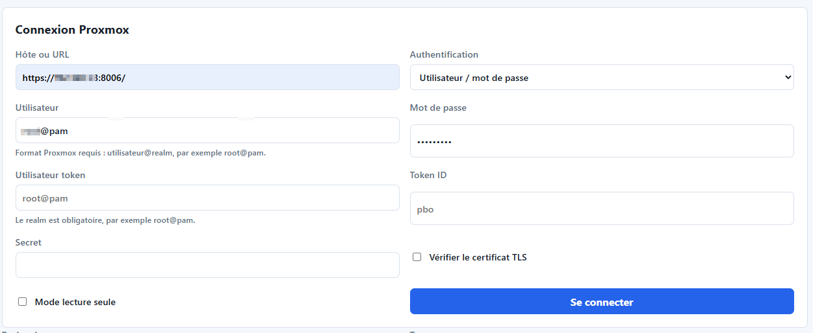
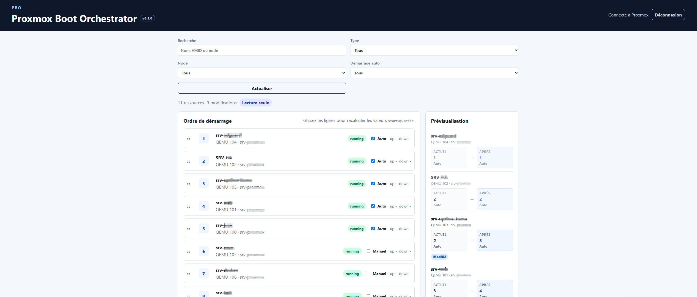
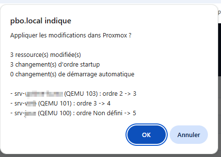

# PBO - Proxmox Boot Orchestrator

Version actuelle : `0.1.3`

PBO est une interface web légère pour visualiser et modifier l'ordre de démarrage des VM QEMU et conteneurs LXC d'un cluster Proxmox VE.

Cette première base couvre le MVP V1 : connexion à Proxmox, découverte automatique des ressources, vue globale, recherche, filtres, réorganisation par drag & drop, prévisualisation et application des paramètres `startup` via l'API officielle Proxmox.

## Aperçu

### Connexion Proxmox



### Vue principale



### Prévisualisation



## Fonctionnalités V1

- Connexion à un cluster Proxmox par mot de passe ou API Token.
- Affichage conditionnel des champs selon le mode d'authentification.
- Support des VM QEMU et des conteneurs LXC.
- Découverte via `/cluster/resources`.
- Lecture des configurations via `/nodes/{node}/{qemu|lxc}/{vmid}/config`.
- Mise à jour de `startup` via l'API Proxmox.
- Lecture et mise à jour de `onboot` pour gérer le démarrage automatique.
- Drag & drop pour recalculer `startup.order`.
- Prévisualisation de l'état actuel et de l'état après modification.
- Confirmation avant application des changements.
- Résultat détaillé par ressource après application.
- Annulation des modifications locales avant application.
- Confirmation avant annulation des modifications locales.
- Recherche par nom, VMID, type ou node.
- Filtres par type, node et démarrage automatique.
- Mode lecture seule.
- Image Docker et Docker Compose.

## Démarrage avec Docker

```bash
docker compose up --build
```

L'application est disponible sur `http://localhost:8080`.

Guide détaillé : [docs/INSTALL-DOCKER.md](docs/INSTALL-DOCKER.md).

## Installation LXC

PBO peut aussi être installé dans un conteneur LXC Debian ou Ubuntu avec Apache, PHP et `php-curl`.

Guide détaillé : [docs/INSTALL-LXC.md](docs/INSTALL-LXC.md).

Statut : installation validée sur LXC.

## Statut des installations

- LXC : validé.
- Docker / Docker Compose : documenté, à valider.

## Permissions Proxmox

Pour une utilisation en production, privilégier un utilisateur Proxmox dédié et un API Token dédié avec les permissions minimales nécessaires sur les VM et conteneurs à administrer.

L'authentification par API Token est le mode recommandé. Voir [docs/PROXMOX-API-TOKEN.md](docs/PROXMOX-API-TOKEN.md).

Le mode lecture seule permet de tester la découverte et la visualisation sans autoriser les mises à jour.

## Application des changements

PBO demande une confirmation avant toute écriture dans Proxmox.

L'application envoie uniquement les champs réellement modifiés :

- `startup` quand l'ordre de démarrage change ;
- `onboot` quand le démarrage automatique change.

Après application, PBO affiche un résultat par ressource. Un échec sur une VM ou un conteneur n'empêche pas les autres modifications d'être tentées.

## Certificats TLS

Si Proxmox utilise un certificat autosigné, décocher `Vérifier le certificat TLS` lors de la connexion. En production, il est recommandé d'utiliser un certificat valide et de conserver la vérification TLS activée.

## Architecture

```text
public/
  app.html      Interface
  app.js        Logique UI, filtres, drag & drop, appels API internes
  styles.css    Styles
  index.php     Routeur HTTP et endpoints JSON
src/
  ProxmoxClient.php  Client API Proxmox
  StartupConfig.php  Parsing et génération du champ startup
```

La version affichée dans l'interface est lue depuis le fichier `VERSION`.

## Endpoints internes

- `POST /api/connect`
- `POST /api/logout`
- `GET /api/session`
- `GET /api/version`
- `GET /api/resources`
- `PUT /api/startup`

## Roadmap

Voir [ROADMAP.md](ROADMAP.md).

## Changelog

Voir [CHANGELOG.md](CHANGELOG.md).
